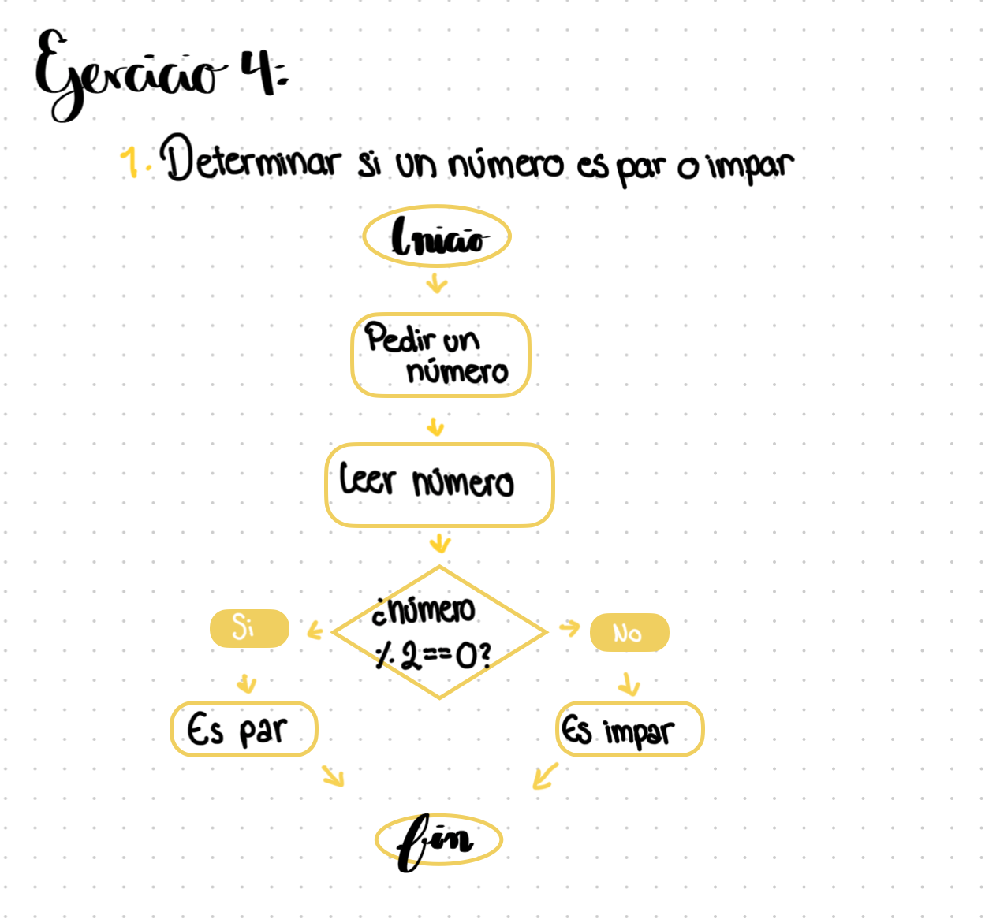
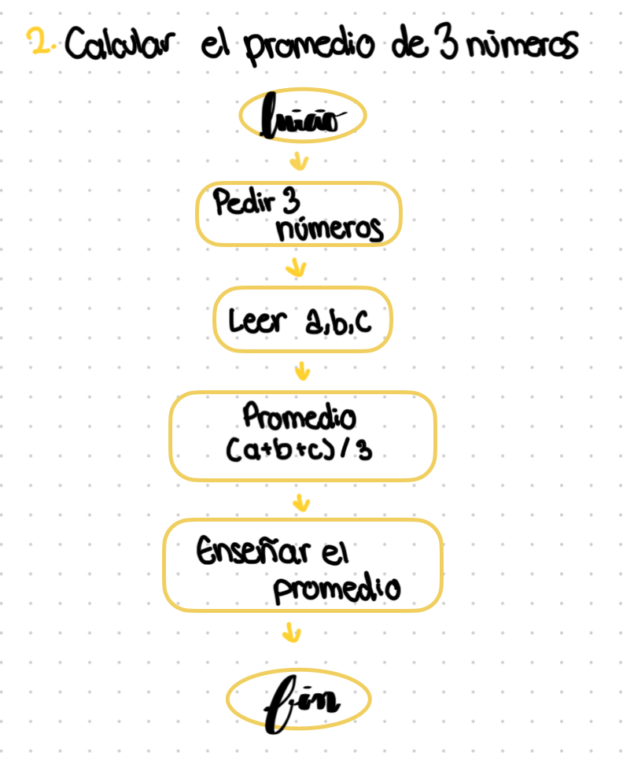
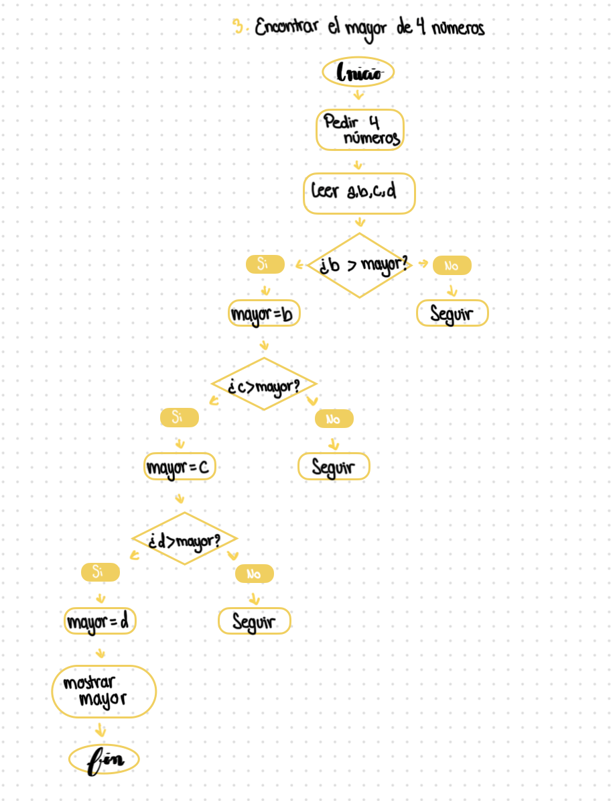

# Semana 1 Consolidado

# Actividad 1

## Caso: DeportivaMX

---

## 1. Perfiles de ciencia de datos

Menciona los perfiles de ciencia de datos que debe contratar la empresa para solucionar el problema. Argumenta el porqué de la contratación de cada perfil.

### 1.1 Data Engineer (Ingeniero de Datos)

Este perfil es fundamental, ya que será responsable de diseñar, construir y mantener la infraestructura de datos. Se encargará de la recolección, transformación y almacenamiento eficiente de grandes volúmenes de datos provenientes de múltiples fuentes.

**Justificación:**

Sin una infraestructura sólida, los datos no pueden ser utilizados correctamente. Este rol permite escalar el sistema y asegurar que los datos estén disponibles y organizados.

---

### 1.2 Científico de datos

Este perfil desarrolla modelos predictivos y análisis avanzados utilizando técnicas de machine learning.

**Justificación:**

Ayuda a predecir comportamientos futuros, como demanda de productos, recomendaciones personalizadas y segmentación de clientes.

---

### 1.3 Analista de datos

El analista de datos se encarga de interpretar la información y generar insights a partir de los datos mediante herramientas de visualización.

**Justificación:**

Permite entender el comportamiento de los clientes, detectar tendencias de compra y apoyar la toma de decisiones estratégicas.

---

### 1.4 Ingeniero de datos

Define la estructura y organización de los sistemas de almacenamiento de datos.

**Justificación:**

Asegura que la arquitectura sea escaláble, eficiente y segura, especialmente importante ante el crecimiento acelerado de la empresa.

---

## 2. Las 5 V del Big Data

Como sabes, los proyectos de Big Data deben cumplir con las cinco "V". Tu tarea en este punto es justificar cómo se relaciona cada característica con el caso planteado.

---

### Volumen

DeportivaMX genera grandes cantidades de datos debido al crecimiento de ventas en línea.

**Relación:**

Se necesita almacenamiento capaz de manejar grandes volúmenes de información.

---

### Variedad

Los datos provienen de distintas fuentes: clientes, productos, transacciones, navegación web.

**Relación:**

Se manejan datos estructurados y no estructurados, lo que requiere tecnologías flexibles.

---

### Velocidad

Los datos se generan en tiempo real a través de compras, visitas y comportamiento del usuario.

**Relación:**

Es necesario procesar los datos rápidamente para ofrecer recomendaciones y mejorar la experiencia del cliente.

---

### Veracidad

Los datos pueden contener errores, duplicados o inconsistencias.

**Relación:**

Es necesario limpiar y validar los datos para asegurar decisiones confiables.

---

### Valor

El objetivo es obtener información útil para mejorar la experiencia del cliente y aumentar ventas.

**Relación:**

El análisis de datos permite generar estrategias comerciales más efectivas.

---

## 3. Arquitectura de almacenamiento

Realiza un análisis y define qué tipo de arquitectura/arquitecturas de almacenamiento de datos es óptima o adecuada para la empresa. Deberás justificar el porqué de la selección, además de plantar y sustentar qué tipo de base de datos NoSQL es la más factible de usar en la empresa.

---

Para la arquitectura de almacenamiento, se propone una solución basada en un Data Lake, complementada con herramientas de procesamiento como Apache Spark y una base de datos NoSQL como MongoDB.

El Data Lake permitirá almacenar grandes volúmenes de datos en su formato original, lo cual es ideal para una empresa en crecimiento como DeportivaMX.

Apache Spark se utilizará para el procesamiento rápido de grandes cantidades de datos, permitiendo generar análisis en menor tiempo.

MongoDB será la base de datos principal para almacenar información de clientes, productos y ventas, debido a su flexibilidad y escalabilidad.

---

## 4. Diseño de colecciones en JSON

Se proponen las siguientes colecciones:

- Clientes
- Productos
- Ventas

Estas colecciones permitirán almacenar y consultar la información de forma eficiente en MongoDB.

```json
{
  "clientes": [
    {
      "_id": "C001",
      "nombre": "Edgar Guerrero",
      "email": "edgarguerrero4@gmail.com",
      "telefono": "4421234567",
      "direccion": {
        "ciudad": "Querétaro",
        "estado": "Querétaro",
        "pais": "México"
      },
      "historial_compras": ["V001", "V003"]
    }
  ],
  "productos": [
    {
      "_id": "P001",
      "nombre": "Tenis",
      "categoria": "Calzado",
      "precio": 1200,
      "stock": 50,
      "caracteristicas": {
        "marca": "Nike",
        "talla": [25, 26, 27],
        "color": "Negro"
      }
    }
  ],
  "ventas": [
    {
      "_id": "V001",
      "cliente_id": "C001",
      "fecha": "2026-03-20",
      "productos": [
        {
          "producto_id": "P001",
          "cantidad": 1,
          "precio_unitario": 1200
        }
      ],
      "total": 1200,
      "metodo_pago": "Tarjeta"
    }
  ]
}
```

---

# Ejercicios complementarios

## **Ejercicios de Matemáticas y Álgebra Básica**

---

### **Ejercicio 1: Operaciones Algebraicas Básicas**

Resolver las siguientes operaciones:

```
a) 3x + 5 = 17      → x = ?
b) 2y - 8 = 22      → y = ?
c) 4z + 3 = 3z + 10 → z = ?
d) 5(x + 2) = 35    → x = ?
```


**Solución:**

- a) x = 4
- b) y = 15
- c) z = 7
- d) x = 5

---

### **Ejercicio 2: Funciones Lineales**

Dada la función f(x) = 2x + 3:

- Calcular f(0), f(1), f(5), f(10)
- Graficar la función e identificar la pendiente y ordenada al origen


---

### **Ejercicio 3: Escalas y Volúmenes (Big Data)**

Expresar en notación científica:

| Cantidad | Notación Científica |
| --- | --- |
| 1,000,000 bytes |  |
| 1,000,000,000 registros |  |
| 1,000,000,000,000 bytes |  |


---

## **Ejercicios de Lógica Computacional**

### **Ejercicio 4: Diagramas de Flujo**

Diseñar un algoritmo simple para:

1. Determinar si un número es par o impar
    
    
    
2. Calcular el promedio de 3 números
    
    
    
3. Encontrar el mayor de 4 números
    
    
    

---

### **Ejercicio 5: Pseudocódigo**

Escribir pseudocódigo para:

1. Calcular el factorial de un número
    
    ```python
    Leer n
    factorial = 1
    
    Para i desde 1 hasta n
       factorial = factorial * i
    
    Mostrar factorial
    ```
    
2. Buscar un elemento en una lista
    
    ```python
    Leer lista
    Leer elemento
    
    Para cada item en lista
       Si item == elemento
          Mostrar "Encontrado"
          Terminar
    
    Mostrar "No encontrado"
    ```
    
3. Ordenar una lista de números
    
    ```python
    Leer lista
    
    Para i desde 0 hasta tamaño
       Para j desde 0 hasta tamaño-1
          Si lista[j] > lista[j+1]
             intercambiar
    
    Mostrar lista ordenada
    ```
    

---

### **Ejercicio 6: Operaciones Booleanas**

Evaluar las siguientes expresiones:

```python
a = True
b = False
c = True

# Evaluar:
print(a and b)      # ?
print(a or b)      # ?
print(not b)       # ?
print(a and c)     # ?
print((a or b) and c)  # ?
```

**RESULTADOS:**

- a and b → **False**
- a or b → **True**
- not b → **True**
- a and c → **True**
- (a or b) and c → **True**

## **Ejercicios de Investigación**

---

### **Ejercicio 7: Historia de la Ciencia de Datos**

Investigar y responder:

1. ¿Quién es considerada la primera científica de datos? 
    
    **Ada Lovelace**
    
2. ¿Qué es el "Data Science Venn Diagram" de Drew Conway? 
    
    Es un modelo de Drew Conway que muestra que la ciencia de datos combina:
    
    - Matemáticas/estadística
    - Programación
    - Conocimiento del dominio
3. Menciona 3 herramientas modernas de Big Data
    - Hadoop
    - Spark
    - MongoDB

---

### **Ejercicio 8: Aplicaciones de Big Data**

Investigar un caso de uso real de Big Data en:

- Salud
- Finanzas
- Redes sociales
- Deportes

### Salud

Uso de Big Data para predecir enfermedades y analizar historiales clínicos.

---

### Finanzas

Detección de fraude en tiempo real mediante análisis de transacciones.

---

### Redes sociales

Recomendaciones de contenido (como TikTok leyendo tu mente, básicamente).

---

### Deportes

Análisis de rendimiento de jugadores y estrategias de juego.
